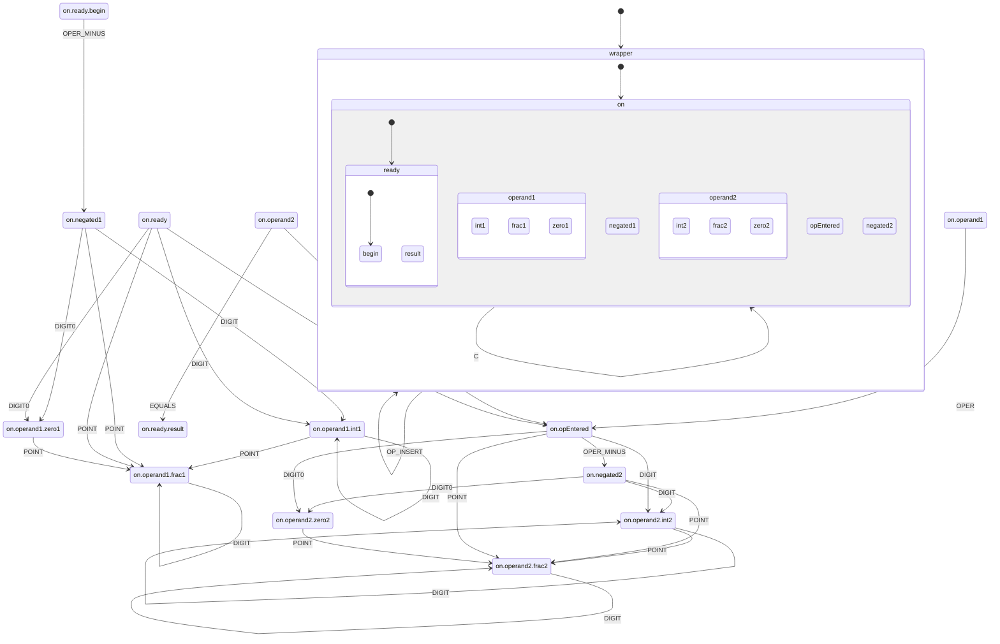

# Markdown

```mermaid

```

stateDiagram-v2
    [*] --> wrapper

    state wrapper {
        [*] --> on

    state on {
            [*] --> ready

    state ready {
                [*] --> begin
                begin
                result
            }

    state operand1 {
                int1
                frac1
                zero1
            }

    negated1

    state operand2 {
                int2
                frac2
                zero2
            }

    opEntered
            negated2
        }
    }

    %% --- transitions (use qualified names for nested states) ---
    on.ready.begin --> on.negated1 : OPER_MINUS

    on.operand1.frac1 --> on.operand1.frac1 : DIGIT
    on.operand2.frac2 --> on.operand2.frac2 : DIGIT

    on.operand1.int1 --> on.operand1.frac1 : POINT
    on.operand1.int1 --> on.operand1.int1 : DIGIT

    on.operand2.int2 --> on.operand2.frac2 : POINT
    on.operand2.int2 --> on.operand2.int2 : DIGIT

    on.negated1 --> on.operand1.frac1 : POINT
    on.negated1 --> on.operand1.int1 : DIGIT
    on.negated1 --> on.operand1.zero1 : DIGIT0

    on.negated2 --> on.operand2.frac2 : POINT
    on.negated2 --> on.operand2.int2 : DIGIT
    on.negated2 --> on.operand2.zero2 : DIGIT0

    on --> on : C

    on.opEntered --> on.operand2.frac2 : POINT
    on.opEntered --> on.operand2.int2 : DIGIT
    on.opEntered --> on.negated2 : OPER_MINUS
    on.opEntered --> on.operand2.zero2 : DIGIT0

    on.operand1 --> on.opEntered : OPER
    on.operand2 --> on.opEntered : OPER
    on.operand2 --> on.ready.result : EQUALS

    on.ready --> on.operand1.frac1 : POINT
    on.ready --> on.operand1.int1 : DIGIT
    on.ready --> on.opEntered : OPER
    on.ready --> on.operand1.zero1 : DIGIT0

    wrapper --> wrapper : CALC_DO
    wrapper --> wrapper : CALC_SUB
    wrapper --> wrapper : DISPLAY_UPDATE
    wrapper --> wrapper : OP_INSERT

    on.operand1.zero1 --> on.operand1.frac1 : POINT
    on.operand2.zero2 --> on.operand2.frac2 : POINT


```mermaid

```
